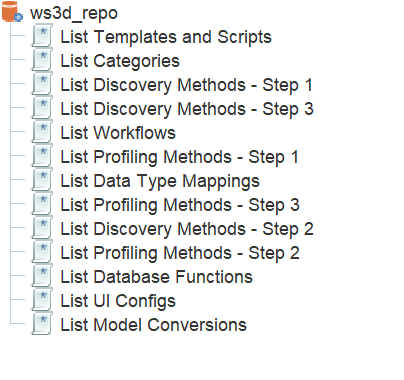

# WhereScape 3D Command Line Exports
WhereScape 3D has a command line interface that allows you to export many aspects of the metadata. Currently you can use this method to export the metadata into xml files that can then be uploaded to a git repository for change tracking or imported into another 3D repository.

The list of metadata items that can currently be exported are shown below, each option will have its own nuances so will have a separate page explaining what is output by the export script. Click on an option to open the page and see more detail.

- mcrexport - Model Conversion Rules
- templateexport - Templates and Scripts
- categoryexport - Category Settings
- dtmexport - Data Type Mappings
- discoveryexport - Discovery Methods
- profilingexport - Profiling Methods
- functionsexport - Database Functions
- uiconfigexport - UI Configurations
- workflowexport - Custom Workflow Settings

You can trigger these exports by calling the powershell script named ws3d-exports.ps1

### Example script calls:

Export the Model Conversion Rules from the ws3d_repo repository to a directory C:\MyDirectory
```
ws3d-exports.ps1 -repo “ws3d_repo“ -exportType mcrexport -workingDirectory “C:\MyDirectory“
```
Export the Category Settings from the ws3d_repo repository to C:\temp and version the export files
```
ws3d-exports.ps1 -repo “ws3d_repo“ -exportType categoryexport -versionExportFile
```
The script can be executed in two different ways depending on your setup. If you have ODBC access to the 3D repository you can supply the DSN name to the script and it will use that to execute queries directly on the repository.

If you do not have ODBC access to the 3D repository then you omit the DSN name to use the command line to run a report against the metadata, the result of which is output to a csv file. The csv file is then read into a powershell object where it can be used to create the data sets. For this approach to work you will have to have the following reports pre-configured in WhereScape 3D :



The reports that have been configured for use in the command line export process all begin with the word “List”. Two of the export processes (discoveryexport & profilingexport) require additional queries that update the metadata at the start of the process and then reset it at the end. More information is available in the individual pages for those processes.

## Script Parameters

| Parameter Name | Mandatory/Optional | Type | Accepted value(s) | Default Value | Purpose |
| --- | --- | --- | --- | --- | --- |
| repo | Mandatory | String | Any valid 3D repository name | Not applicable | To be passed to the 3D command line so that it knows which repository to execute the command on |
| exportType | Mandatory | String | mcrexport, templateexport, categoryexport, dtmexport, discoveryexport, profilingexport, functionsexport, uiconfigexport, workflowexport | Not applicable | To be passed to the 3D command line so that the appropriate command is executed, also used for directory naming purposes |
| dsn | Optional | String | Name of an ODBC DSN that points to a 3D repository | Not applicable | To provide direct connectivity to the 3D repository and avoid the need to have reports configured. |
| workingDirectory | Optional | String | Any valid directory | C:\temp | Location to store all files and directories created by the script |
| ws3dJavaLocation | Optional | String | Directory containing the 3D java.exe file | C:\Program Files\WhereScape\WhereScape 3D\jre\bin\java | To trigger the 3D command line only needs to be supplied if not in the default install location |
| ws3dJarLocation | Optional | String | Directory containing the WhereScape-3D-HEAD-bundle.jar file | C:\Program Files\WhereScape\WhereScape 3D | To trigger the 3D command line only needs to be supplied if not in the default install location |
| versionExportDirectory | Optional | Switch | -versionExportDirectory or omitted | false | To enable the date and time to be appended to any generated export directories as a way of versioning them |
| versionExportFile | Optional | Switch | -versionExportFile or omitted | false | To enable the date and time to be appended to any generated export files as a way of versioning them |
| excludeWsMethods | Optional | Switch | -excludeWsMethods or omitted | false | Used with the discoveryexport and profilingexport exportType to control whether or not the script generates files for the out of the box WhereScape methods |